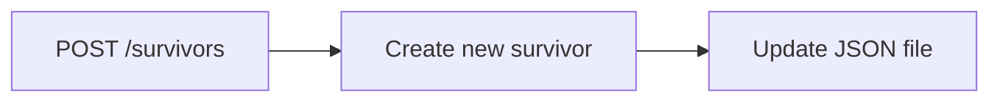

## Brug cirka 20 minutter i gruppen på at besvare følgende: 

**Hvilke routes skal I have?** for at get it to work minimum
- GET /survivors 
- POST /survivors
- POST /survivors/:id/scavenge


**Hvordan skal et JSON-objekt se ud?**
```json
{
  "id": "1",
  "name": "John Doe",
  "health": 30,
  "food": "New York",
  "weapon": "healthy",
  "location": "New York",
  "score": "100",
  "isAlive": "true"
}
```

**Hvilke oplysninger skal brugeren sende ved oprettelse?**
- name
- weapon
- location

**Hvad kan gå galt, og hvilke statuskoder skal returneres?**
- 200 OK - Request was successful
- 201 Created - Resource was successfully created
- 400 Bad Request - The request was invalid or cannot be served.
- 404 Not Found - The requested resource could not be found
- 500 Internal Server Error - An error occurred on the server side.

**Hvem arbejder med de enkelte dele?**

Vi følges ad i opagven og snakker undervejs

**Tegn gerne et enkelt dataflow fra en POST-request til den opdaterede JSON-fil.**


## Refleksionsspørgsmål 

Besvar kort disse spørgsmål: 

**Hvad er forskellen på GET og POST?**

Serveren giver data med GET og POST sender data til serveren

**Hvorfor bruger vi express.json()?**

Det er en middleware. Det er den linje der sørge for at express forventer svar i form af json, i stedet for e.g. rent tekst.

**Hvorfor er det en fordel at sende data som JSON?**

Json er en letlæselig og struktureret måde at sende data på som kan bruges på tværs af forskelige programmeringssprog.

**Hvorfor er det smart at lægge loggeren i en separat fil?**

Det er nemmer at veligehålde og genbruge den samme logger i flere forskellige filer, i stedet for at skulle skrive den samme kode flere gange.

**Hvad kan gå galt, hvis flere brugere skriver til samme JSON-fil på samme tid?**

Samtidige requests kan overskrive hinandens ændringer

**Hvorfor bør rigtige adgangsnøgler ikke ligge direkte i koden?**

Fordi det kan udgøre en sikkerhedsrisiko, hvis koden bliver offentliggjort eller kompromitteret.

**Hvordan ville projektet ændre sig, hvis data skulle gemmes i en rigtig database?**

Det meste af logikken forbliver det samme, vi skal skive database ændre koden til at kunne håndtere database forespørgsler i stedet for at skrive til en fil.


## Code Review (AI)
AI kom med 5 forslag til forbedringer af koden,
vi valgte at implementere forslag 1 
som gik ud på at Inputvalidering accepterer forkerte typer og tomme værdier.
 
Ai kom med, hvor i programmet problemet opstår, 
hvad problemet var og hvordan det kan testes. Vi testede og kom frem til at der var et problem med inputvalidering som accepterer forkerte typer og tomme værdier,
vi gav den besked på at komme med forslag til hvordan det kunne løses.
Vi gennem kigget planen og vuderet at det var en god plan, den kom ikke med et kokret forslag til hvordan det kunne løses, men den kom med hvad der var galt. 
Vi endte med at prøve at implementere det selv først, hvor det ikke lykkedes. Hvorefter AI igen fik lov at gennemgå vores løsning og finde evt. fejl, vi kunne rette, så det virker.

Ai'en forslog at man kunne lave en local validering som valideret for whitespace og type checking at input er en string. 
Hvad vi komm frem til var at putte .trim og typeof i vores if statements og lave flere if statmens en for hver værdi. 

**Testresultat**
```json
[ 
  {
    "name": 123,
    "health": 100,
    "food": 50,
    "weapon": {},
    "location": " ",
    "score": 0,
    "isAlive": true
  }  
]
```

Tested for om der kunne være tal, tuborg panteser og om man kunne have mellemrum.

Vi forventede en statusCode 400 og e.g. name is required, men fik 201 Created Succesfully. Efter AI review blev det igen testet og vi endte med en statusCode 400 og e.g. name is required, som forventet.

