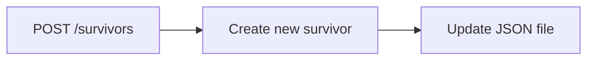

## Brug cirka 20 minutter i gruppen på at besvare følgende: 

**Hvilke routes skal I have?** for at get it to work minimum
- GET /survivors 
- POST /survivors
- POST /survivors/:id/scavenge


**Hvordan skal et JSON-objekt se ud?**
```json
{
  "id": "1",
  "name": "John Doe",
  "health": 30,
  "food": "New York",
  "weapon": "healthy",
  "location": "New York",
  "score": "100",
  "isAlive": "true"
}
```

**Hvilke oplysninger skal brugeren sende ved oprettelse?**
- name
- weapon
- location

**Hvad kan gå galt, og hvilke statuskoder skal returneres?**
- 200 OK - Request was successful
- 201 Created - Resource was successfully created
- 400 Bad Request - The request was invalid or cannot be served.
- 404 Not Found - The requested resource could not be found
- 500 Internal Server Error - An error occurred on the server side.

**Hvem arbejder med de enkelte dele?**

Vi følges ad i opagven og snakker undervejs

**Tegn gerne et enkelt dataflow fra en POST-request til den opdaterede JSON-fil.**


## Refleksionsspørgsmål 

Besvar kort disse spørgsmål: 

**Hvad er forskellen på GET og POST?**

**Hvorfor bruger vi express.json()?**

**Hvorfor er det en fordel at sende data som JSON?**

**Hvorfor er det smart at lægge loggeren i en separat fil?**

**Hvad kan gå galt, hvis flere brugere skriver til samme JSON-fil på samme tid?**

**Hvorfor bør rigtige adgangsnøgler ikke ligge direkte i koden?**

**Hvordan ville projektet ændre sig, hvis data skulle gemmes i en rigtig database?**


## CODE REVIEW AI 
